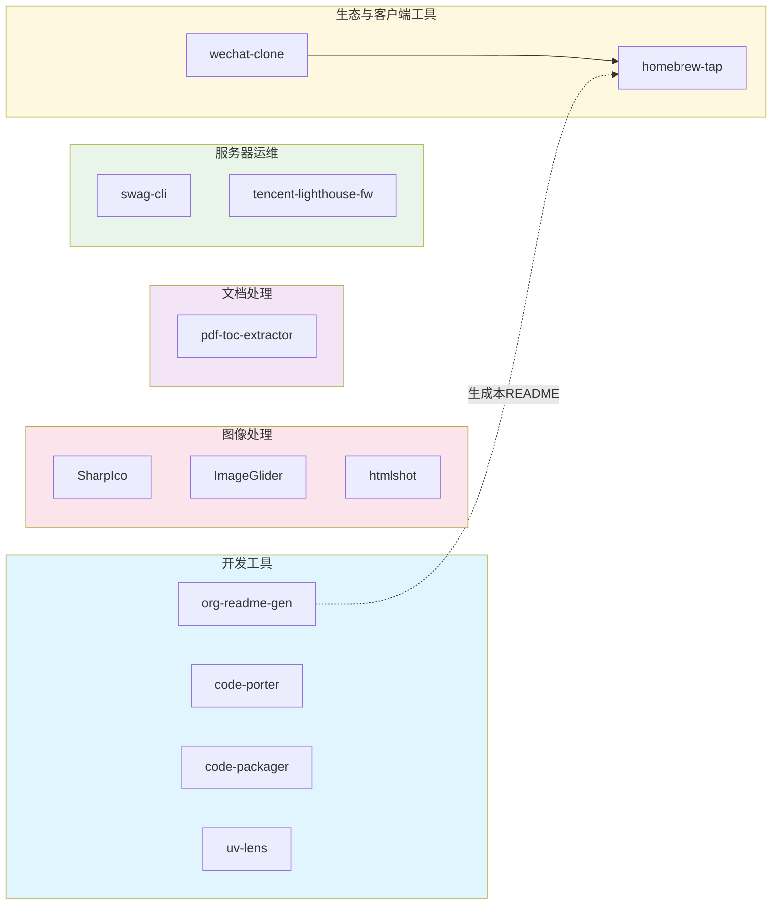

# Star Plan
**致力于提供实用、轻量的小工具解决方案**

---

## 项目关系图
我们的项目围绕提升开发、运维和办公效率展开，彼此之间存在关联或补充关系。下图展示了主要项目及其所属领域。

---

## 项目总览

| 名称 | 说明 | 语言 | Stars |
| :--- | :--- | :--- | :--- |
| [sharp-ico](https://github.com/star-plan/sharp-ico) | 纯 C# 图标生成工具，将 PNG 转换为多尺寸 Windows .ico 文件。 | C# | 125 |
| [image-glider](https://github.com/star-plan/image-glider) | 基于 .NET 8 和 ImageSharp 的跨平台批量图像格式转换工具。 | C# | 54 |
| [pdf-toc-extractor](https://github.com/star-plan/pdf-toc-extractor) | 从 PDF 文件提取目录（TOC）并支持多种输出格式的 .NET 工具。 | C# | 22 |
| [code-porter](https://github.com/star-plan/code-porter) | Git-first 工作区迁移规划器，实现代码仓库的扫描、导出和零配置导入。 | Python | 2 |
| [wechat-clone](https://github.com/star-plan/wechat-clone) | macOS 微信分身管理 CLI 工具，支持创建、管理和启动多个微信客户端。 | Go | 0 |
| [org-readme-gen](https://github.com/star-plan/org-readme-gen) | 利用 LLM 自动生成 GitHub 组织主页 README 的命令行工具。 | Python | 0 |
| [tencent-lighthouse-fw](https://github.com/star-plan/tencent-lighthouse-fw) | 面向腾讯云轻量应用服务器（Lighthouse）防火墙白名单的自动更新工具。 | Python | 0 |
| [homebrew-tap](https://github.com/star-plan/homebrew-tap) | 为 Star Plan 组织下工具提供 Homebrew 安装支持的 Tap 仓库。 | Ruby | 0 |
| [.github-private](https://github.com/star-plan/.github-private) | 组织的 GitHub 配置与元信息仓库。 | 未知 | 0 |
| [swag-cli](https://github.com/star-plan/swag-cli) | 专为 LinuxServer.io SWAG 容器设计的命令行配置与管理工具。 | Go | 0 |
| [code-packager](https://github.com/star-plan/code-packager) | 智能压缩代码库，自动排除不必要文件，生成精简的压缩包。 | Python | 0 |
| [uv-lens](https://github.com/star-plan/uv-lens) | 解析 `pyproject.toml` 依赖项，查询 PyPI 最新版本并生成升级建议与命令。 | Python | 0 |
| [htmlshot](https://github.com/star-plan/htmlshot) | 将 HTML 内容转换为 PNG 图片的工具。 | C# | 0 |

---

## 项目详情

### sharp-ico
一款轻量、高效的 Windows 图标生成工具。核心价值在于纯 C# 实现，无需依赖任何外部软件（如 ImageMagick），可将单张高分辨率 PNG 一键转换为符合规范的多尺寸 .ico 文件（16x16 至 256x256）。内置 .ico 文件结构分析功能，便于验证。

### image-glider
基于现代 .NET 8 与 ImageSharp 构建的跨平台批量图像格式转换工具。支持 AOT 编译，可独立分发。它能自动扫描目录中的图片文件，批量转换为目标格式，并智能管理输出文件、错误记录和转换日志，适合处理大批量的图像转换任务。

### pdf-toc-extractor
专注于从 PDF 文档中提取目录（Table of Contents）信息的 .NET 工具。它可以将提取的目录结构导出为多种文本格式（如 Markdown、JSON），方便用于文档分析或生成导航结构。

### code-porter
一个面向代码仓库迁移的“Git-first”规划工具。它可以扫描指定工作区内的所有 Git 仓库，将其打包导出，并能在新环境中无需预先克隆就完成导入和仓库初始化，极大简化了开发环境的迁移和备份流程。

### wechat-clone
专为 macOS 设计的微信分身管理 CLI 工具。它允许用户方便地创建、列出、启动和管理多个微信客户端实例，适用于需要同时登录多个账号的场景。还支持分身应用的签名修复和运行环境诊断。

### org-readme-gen
一个利用大型语言模型（LLM）能力，为 GitHub 组织自动生成精美、结构化主页 README 的命令行工具。旨在自动化组织文档的维护，提升开源项目的专业形象。

### tencent-lighthouse-fw
针对腾讯云轻量应用服务器（Lighthouse）防火墙的安全运维工具。它可以自动更新指定的 IP 白名单，帮助用户动态管理服务器的访问控制策略，增强安全性。

### homebrew-tap
作为 Star Plan 组织工具的 Homebrew 官方软件源（Tap）。用户添加此 Tap 后，即可通过 `brew install` 命令便捷地安装组织内提供 macOS 支持的工具（如 `wechat-clone`）。

### .github-private
组织的元数据配置仓库，用于存放 GitHub 组织的社区健康文件（如 Issue/PR 模板、资助信息等）和其他公开配置。

### swag-cli
一个为 [LinuxServer.io SWAG](https://docs.linuxserver.io/general/swag) 容器（基于 Nginx 的反向代理）设计的辅助 CLI。它可以自动发现 Docker 容器并生成对应的 Nginx 反向代理配置文件，简化 Web 应用的配置过程。

### code-packager
一个智能的代码打包助手。它能分析项目结构，根据 `.gitignore` 或自定义规则，自动在压缩时排除依赖、构建产物等冗余文件，生成干净、轻量的代码压缩包，便于分享和部署。

### uv-lens
一个 Python 依赖管理辅助工具。它能够解析 `pyproject.toml` 文件中的项目依赖，并查询 PyPI（支持私有源）获取最新稳定版本信息，最终生成可视化的升级建议以及可直接执行的 `uv add` 升级命令。

### htmlshot
一个简单的工具，用于将 HTML 内容（如字符串、URL 或本地文件）转换为 PNG 图片。可用于快速生成网页缩略图、测试邮件模板的视觉效果或创建静态快照。

---

## 技术栈概览

我们的项目围绕高效与实用的原则，选用了以下技术栈：

- **C# / .NET (8+)**：用于开发高性能、跨平台的命令行工具和图形处理工具，支持 AOT 编译以实现零依赖部署。
- **Python**：广泛应用于自动化脚本、开发辅助工具和云服务运维工具，凭借其丰富的生态快速实现功能。
- **Go**：用于构建系统级 CLI 工具，追求极致的编译速度和单一二进制文件的便捷分发。
- **Ruby**：主要用于维护 Homebrew Tap 这类包管理生态的配置。